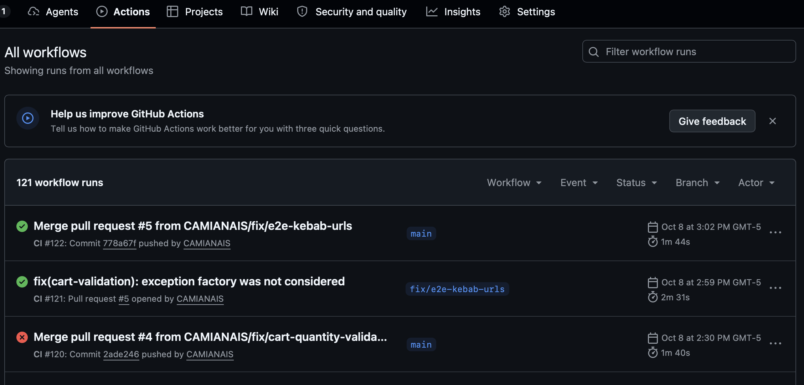
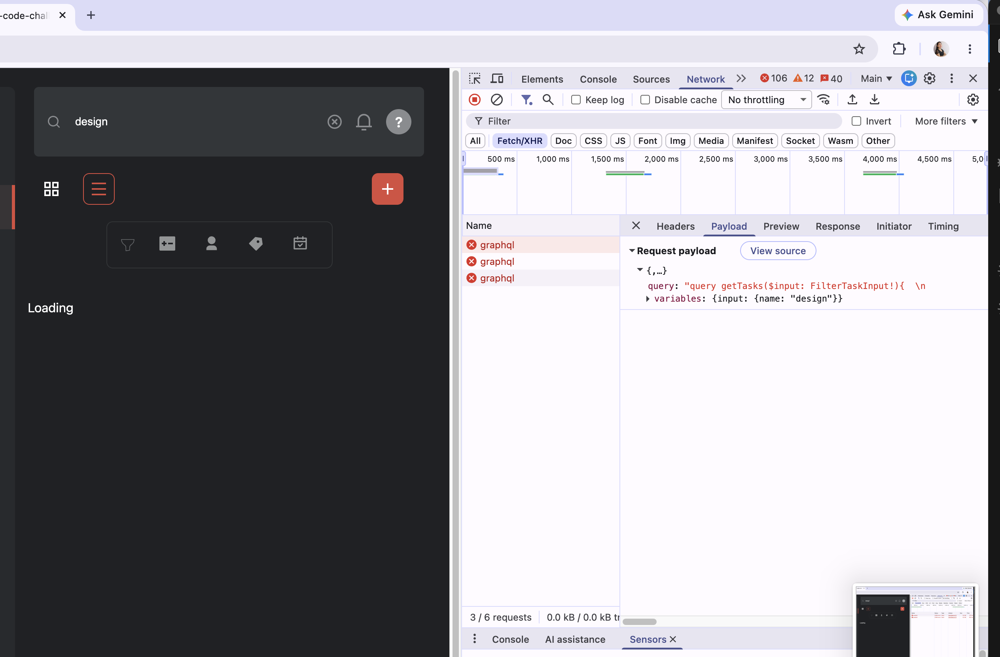

# Polish Week Report: Camila Mamani

> Ravn cohort, AQP · Oct 5 – 9, 2026
> One week to revisit my work, fix what I would do differently, and show what I learned.

🎥 **Demo video (6 min, RAVN only):** [watch on Google Drive](https://drive.google.com/file/d/19mMoWAvfXx2uYVYIS_5TuVuXc8_Ymb1l/view?usp=share_link)

**TL;DR** _(write this last, 3 sentences)_
_I reviewed my four cohort projects as if I were the evaluator. I found and fixed X bugs, the most important being … I learned …_

---

## 1. What I reviewed

| Project               | Track       | What it is                                         | Repo                                                                                                                              |
| --------------------- | ----------- | -------------------------------------------------- | --------------------------------------------------------------------------------------------------------------------------------- |
| T-Shirt Store API     | Backend     | NestJS + Prisma + Stripe e-commerce API            | [link](https://github.com/CAMIANAIS/T-Shirt-Store-API)                                                                            |
| Task Management       | Frontend    | React + TanStack Query task board on a GraphQL API | [link](https://github.com/CAMIANAIS/Task_Management_Code_Challenge)                                                               |
| Vello Fidelity Review | Design + AI | Design fidelity audit and `ProviderCard` component | [link](https://github.com/CAMIANAIS/vello-fidelity-review)                                                                        |
| ReNest                | PM          | Problem frame → PRD → RICE → delivery plan         | [link](https://github.com/CAMIANAIS/ReNest)                                                                                       |
| QA Round Robin        | QA          | Test cases and bug reports                         | [link](https://github.com/ravn-qa/qa-nerdery-round-robbin-week-trainees/tree/main/trainees/development/submissions/camila-mamani) |

**How I reviewed:** _I read each repo as an evaluator would, ran lint, build and tests, used the app as a user, and listed every place where I could not explain my own code or where the code contradicted my docs._

## 2. What I found

| #   | Project  | Problem                                                                       | Why it matters to the user               | Severity | What I did |
| --- | -------- | ----------------------------------------------------------------------------- | ---------------------------------------- | -------- | --- |
| 1   | API      | Two buyers can pay for the last item, and the second is charged with no order | Customer loses money                     | 🔴       | Fixed → API #3 |
| 2   | API      | A paid order can be cancelled with no refund                                  | Customer or store loses money            | 🔴       | Known limitation |
| 3   | API      | Payment links are reusable and identify the user, not the order               | Wrong orders, endless webhook retries    | 🔴       | Next step |
| 4   | Frontend | The "Update" button in the edit modal does nothing                            | User thinks changes are saved or unsaved | 🟡       | Next step |
| 5   | Frontend | Search sends a request on every keystroke                                     | Slow UI, wasted requests                 | 🟡       | Fixed → TM #3 |

## 3. What I fixed

| PR                                                                          | Project  | Fix                                                                                               | Test that proves it                                                         | Status |
| --------------------------------------------------------------------------- | -------- | ------------------------------------------------------------------------------------------------- | --------------------------------------------------------------------------- | ------ |
| [API #1](https://github.com/CAMIANAIS/T-Shirt-Store-API/pull/1)             | API      | AI module: renamed endpoints to kebab-case and improved skill descriptions. Added fresh-session base-commit evidence for the audit skill, and synced the e2e harness with production | e2e asserts exact status codes for the new URLs | ✅     |
| [API #3](https://github.com/CAMIANAIS/T-Shirt-Store-API/pull/3)             | API      | Prevent overselling the last shirt: conditional update, cancel + refund buyer B (idempotency key) | e2e: two webhooks for the last unit, refund spy called once with B's intent | ⏳     |
| [API #4](https://github.com/CAMIANAIS/T-Shirt-Store-API/pull/4)             | API      | Reject negative and decimal cart quantities (`@IsInt` + `@IsPositive`)                            | e2e: `-3` and `1.5` return 400                                              | ✅     |
| [API #5](https://github.com/CAMIANAIS/T-Shirt-Store-API/pull/5)             | API      | After merging #1 and #4, main CI broke. I found the old URL with grep (`/auth/signin` → `/auth/sign-in`) and changed the expected status to 422, because the test was not using the exception factory I have in production | CI passed on main | ✅     |
| [TM #2](https://github.com/CAMIANAIS/Task_Management_Code_Challenge/pull/2) | Frontend | Lint 7 → 0: remove `any`, move hooks, contexts and constants to their own files                   | `npm run lint` 0 errors, `npm run build` passes                             | ⏳     |
| [TM #3](https://github.com/CAMIANAIS/Task_Management_Code_Challenge/pull/3) | Frontend | Debounce search (300 ms) + ✕ clears the box and the filter                                        | Network tab: typing "design" sends only `des` and `design`                  | ⏳     |
| [ReNest #1](https://github.com/CAMIANAIS/ReNest/pull/1)                     | PM       | Tradeoffs and decisions below 3 PRD features                                                      | Review by PM mentor                                                         | ⏳     |

_Status: ⏳ open · 👍 approved · ✅ merged_

## 4. Key decisions and tradeoffs

### Overselling: refund vs reservation

- **Options:** refund or reservation (like cinemas)
- **I chose:** refund
- **Because:** it works for my business, where it rarely happens
- **Tradeoff:** Refund is simpler, but buyer B pays and gets the money back days later. Reservation avoids that, but someone can reserve and never pay, so the shirt is blocked for others, and I need extra code to release it.
- **Guardrail:** I expect less than 5 refunds per week. If it is more than that, I'll change the code and consider reservation.

### Paid order can be cancelled with no refund (1.2): known limitation

- **Options:** full fix (table of allowed status changes + one `assertTransition()` function), small fix (only block cancelling a paid order), or don't fix it now
- **I chose:** don't fix it now, and write it as a known limitation
- **Because:** I didn't want to overload my backend mentor, who was already reviewing my other PRs
- **Tradeoff:** the customer loses their money and doesn't get the shirt. The store gets a bad reputation.

### Demo accounts: keep them public

- **Options:** remove the manager login from the README, or keep the demo accounts public
- **I chose:** keep them public
- **Because:** this is the way reviewers can log in using different roles
- **Tradeoff:** bots or any user can, for example, deactivate products. I accept it because it is for learning purposes only.

## 5. Before / after

**Main CI: red after merging #4 → green after #5 (API)**

**Search with debounce (Task Management #3):** typing "design" sends the search with the full word, not one request per letter. The requests are red because the cohort API is down; the 3 rows are retries of the same request.

## 6. How I used AI

I used concepts I learned in my CCA-F certification preparation.

### 1. My rules for Claude (`CLAUDE.md`)

- Teach, ask questions and quiz me. Don't write my fixes, tests or report text.
- Push me to explain _why_, and to compare options and tradeoffs.
- Keep messages short and in simple English.
- Remind me of these rules when I drift from them.

### 2. My 2 skills

The description is how Claude chooses which skill to use.

| Skill | Description |
| --- | --- |
| `consistency-kebab-url-endpoints` | Audit NestJS controllers and Markdown docs for kebab-case URL violations: route naming, endpoint rename, camelCase/snake_case paths. Reports file, line, and the corrected path. |
| `verify-kebab-rename-e2e` | Run e2e tests to verify a kebab-case URL rename succeeded: old paths return 404, new paths respond with the expected status. Use after applying renames from the audit skill. |

### 3. How I controlled it

Permissions, pre-commit hooks, CI and the DB `CHECK` constraint. These are deterministic.

### 4. How I checked it

- Independent reviewers: my mentors reviewed my PRs, and a peer reviewed my projects.
- The times I caught AI-generated code that didn't match my file.
- The Claude session I work with is not able to see its own mistakes. So when I want an immediate second opinion, I use another Claude Desktop session or Codex to criticize the AI output.

### 5. When AI was wrong

I was writing issues for a peer's project. I normally ask another AI to criticize my critique and suggest what else I could add, because I want my issues to help the most. It gave me terms that his project did not have. I checked his repo, and those terms were not there. I kept only two acceptance criteria that help to measure the fix.

## 7. What I learned

Feedback made me grow.

1. Asking for review on my PRs helped me grow. It challenged me in ways I was not able to see myself.
2. Tests are only as true as their setup. A green test can still be wrong: my test checked 400, a status real users never get, because the test setup didn't match production.
3. If I am going to use debounce many times, I make it a generic reusable hook, so I can call it when I need it.

## 8. What I would still improve

**Backend**
- Race test with `Promise.all`. Right now I only test the sold-out path (buyer A, then buyer B).
- Test the refund with real Stripe test mode, not only a mock.
- Fix 1.2: allowed order status changes, so a paid order can't be cancelled with no refund.
- Learn decorators deeply.

**Frontend**
- The "Update" button in the edit modal.

**Peer review**
- Reply to and fix the issues my peer opened on my API (#6–#9: lint warnings, e2e env, setup docs).

## 9. My plan: certifications

| Certification | Exam by |
| --- | --- |
| Claude Certified Architect – Professional | Oct 31, 2026 |
| AWS Certified Cloud Practitioner | End of November 2026 |
| AWS Certified Solutions Architect – Associate | End of December 2026 |

## 10. Daily progress

[Day 1](daily-log/day-1.md) · [Day 2](daily-log/day-2.md) · [Day 3](daily-log/day-3.md) · [Day 4](daily-log/day-4.md) · [Day 5](daily-log/day-5.md) · [Full plan](PLAN.md)
